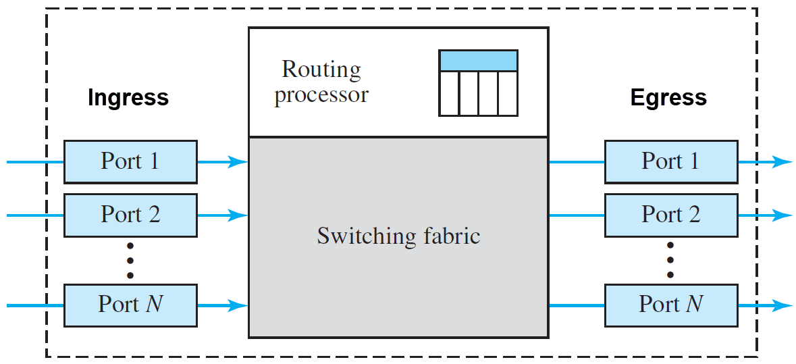
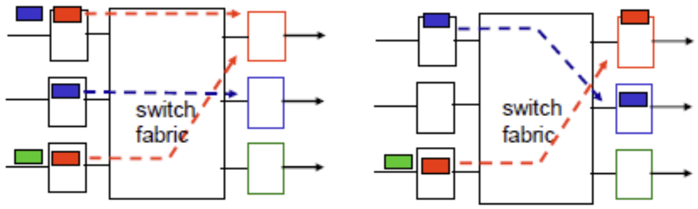

# Switch Architecture

This document provides a high-level overview of how network switches are designed internally: the separation between the control plane and the data plane, how packets traverse the switch, why specialized forwarding hardware (NPUs) is used, and how switches handle congestion through queuing. These concepts apply to any modern data center switch, not just a specific vendor or model.

## Control Plane and Data Plane

Every network switch operates across two distinct processing domains:

- **Control plane** — The software-driven domain. A general-purpose CPU runs the network operating system (NOS), executes routing protocols (BGP, OSPF), negotiates protocol adjacencies, and computes forwarding decisions. It handles complex but infrequent tasks.

- **Data plane** — The hardware-driven domain. A purpose-built chip called a **network processing unit (NPU)** performs the actual forwarding of packets at wire speed. In the networking industry, NPUs are also referred to as switching ASICs, forwarding ASICs, or merchant silicon (when sold by a chip vendor to multiple switch manufacturers). The NPU does not compute routes or run software — it executes pre-programmed forwarding rules that the control plane installed.

This division is what allows a switch with a modest embedded processor to forward terabits per second of traffic: the CPU computes a routing decision once (e.g., BGP best path) and programs it into the NPU, which then handles all matching packets autonomously without further CPU involvement.

| Domain        | Component            | Role                                                   |
| ------------- | -------------------- | ------------------------------------------------------ |
| Data plane    | NPU (switching ASIC) | Forwards packets at wire speed across all ports        |
| Control plane | Management CPU       | Runs the NOS, routing protocols, and programs the NPU  |

## Why Specialized Hardware

A general-purpose CPU processes instructions sequentially and is optimized for flexibility: branch prediction, speculative execution, caches, and complex instruction sets. These features make CPUs ideal for control-plane tasks but unsuitable for data-plane forwarding at scale.

Consider the math for 100G Ethernet. At minimum-size packets (64 bytes), a single 100G port must process approximately **148.8 million packets per second**. A 32-port 100G switch must handle up to **4.76 billion packets per second** across all ports simultaneously. Each packet requires parsing headers, looking up forwarding tables, applying ACLs (Access Control Lists), updating counters, and queuing for output — all within a few hundred nanoseconds. No general-purpose CPU can sustain this rate.

NPUs solve this by implementing the forwarding logic directly in hardware:

- **Fixed-function pipelines** process packets in parallel across all ports simultaneously, rather than sequentially on a single instruction stream.
- **On-chip forwarding tables** (TCAM — Ternary Content-Addressable Memory — and hash-based) perform lookups in a single clock cycle, rather than traversing software data structures in memory.
- **Hardware schedulers and queuing engines** manage traffic shaping, priority, and congestion at wire speed without CPU intervention.
- **Integrated SerDes** convert between the chip's internal bus and the high-speed electrical signals on each port, eliminating the need for external PHY chips at these speeds.

The trade-off is flexibility: an NPU's forwarding behavior is defined by its pipeline design at fabrication time. It can only perform the operations its silicon was built to support. This is why different NPU families exist — Broadcom's Tomahawk optimizes for raw bandwidth, while Trident optimizes for feature depth and programmability (see [NPU Silicon](02_npu_silicon.md)).

## The Transit Path

A forwarded packet makes a three-part journey through the data plane:

- **Ingress** — The physical port where a packet enters the switch. The NPU's forwarding engine immediately parses the packet headers to determine the destination.

- **Switch fabric** — The high-speed internal crossbar that connects all ports. It transports the packet from the ingress port to the correct egress port. In single-chip designs (such as the Broadcom Tomahawk), the crossbar is integrated into the ASIC itself.

- **Egress** — The physical port where the packet leaves the switch toward its next hop.

A physical port operates as both ingress and egress simultaneously. In full-duplex mode, a 100G port can receive 100 Gbps and transmit 100 Gbps at the same time without interference. This is why switch throughput is sometimes quoted as double the port-speed sum (e.g., 6.4 Tbps full-duplex for a 3.2 Tbps switch).

## Queuing

In a perfect world, every packet flows instantly from ingress, across the fabric, and out the egress port. In practice, network traffic is bursty. Congestion occurs most often in a "many-to-one" pattern, where multiple ingress ports simultaneously send traffic toward a single egress port. Because an egress link can only serialize one packet at a time, the switch cannot forward the excess immediately. Instead of dropping those packets, the switch holds them in **queues** — temporary buffers that preserve packet order until the hardware is ready to transmit.

Modern switches use queues at two stages of the transit path:

- **Egress queues** sit right before the output port. Their primary role is QoS (Quality of Service) scheduling and shaping — when multiple packets compete for the same exit, the egress queue ensures high-priority traffic (e.g., latency-sensitive control messages) is transmitted before lower-priority traffic (e.g., background bulk transfers).

- **Ingress queues** sit at the entry of the switch, before the fabric. Their primary role is congestion absorption — if an egress queue fills up, the switch signals upstream to stop sending it traffic. Packets destined for that overloaded output wait in an ingress queue until the congestion clears.

### Head-of-Line (HoL) Blocking

Ingress queues introduce a subtle performance problem. Historically, switches placed all incoming packets into a single FIFO (First In, First Out) queue per ingress port. If the packet at the front of the queue is destined for a congested egress port, it stalls — and every packet behind it stalls too, even if those trailing packets are destined for completely idle egress ports. This is **Head-of-Line (HoL) blocking**.

In the diagram above, the switch fabric can transfer one packet per destination port at a time. At time $t$, both the top and bottom input ports have a red packet at the front of their queues, both destined for the top output port. The switch allows the top red packet to cross. The bottom red packet loses contention and waits. The green packet behind it — destined for the idle bottom output port — is blocked simply because it is not at the head of the line.

### Virtual Output Queuing (VOQ)

Modern high-performance switches eliminate HoL blocking with **Virtual Output Queuing (VOQ)**. Instead of a single queue per ingress port, the switch maintains a separate logical queue for every possible egress port. When a packet arrives, the switch determines its destination and places it into the VOQ for that specific egress port.

If egress port A becomes congested, only the VOQ for port A backs up. A packet arriving at the same ingress port but destined for an uncongested port B bypasses the congestion entirely through its own dedicated VOQ. By organizing ingress buffers by egress destination, VOQ ensures that congestion on one port never degrades forwarding performance to other ports.

## Traffic Types

Not all traffic follows the same path through the switch:

- **Data traffic** — Standard forwarded traffic (user applications, storage, compute). This is the vast majority of packets. Data traffic enters at ingress, passes through the queuing and fabric stages described above, and exits at egress without ever touching the CPU. This ASIC-only journey is called the **fast path**.

- **Control traffic** — Protocol traffic from other network devices (BGP updates, OSPF hellos, LLDP, ARP). These packets are intercepted by the NPU and diverted up to the control plane for software processing.

- **Management traffic** — Administrative sessions directed at the switch itself (SSH, SNMP, REST API). These also require CPU processing.

Control and management traffic follow the **slow path**: the NPU traps the packet and sends it to the CPU for software processing. The slow path is orders of magnitude slower than the fast path but handles only a tiny fraction of total traffic.

## Control Plane Policing (CoPP)

The CPU is a slow, shared resource receiving trapped packets from all ports. A flood of ARP requests or ICMP pings does not affect the NPU (it can trap millions per second), but every trapped packet lands on the CPU. Without rate-limiting, a burst of control traffic — malicious or accidental — can starve routing protocols of CPU cycles and destabilize the entire switch.

CoPP protects the CPU by rate-limiting the trap path. Trapped packets are classified into categories (BGP, ARP, ICMP, SSH, etc.), and each category is assigned its own rate limit. Packets within the allowed rate are delivered to the CPU; packets exceeding the rate are dropped before reaching it. CoPP sits at the boundary between the fast path and the slow path — the same position shown in the architecture diagram above.
